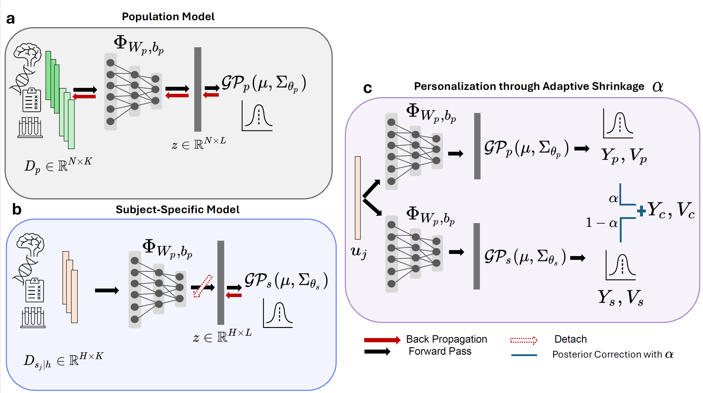

# Adaptive Shrinkage Deep Kernel Gaussian Process 

This repository contains the official implementation of the paper:

**"Adaptive Shrinkage Estimation for Personalized Deep Kernel Regression in Modeling Brain Trajectories"**  
*Accepted at International Conference on Learning Representations (ICLR) 2025*

## Overview

This project implements an adaptive shrinkage estimation framework for personalized deep kernel regression, specifically designed for modeling individual brain trajectories. The method combines population-level deep kernel Gaussian processes with subject-specific models using Adaptive Shrinkage Estimation.

For a detailed description of the method, please refer to our [method description document](docs/method_description.pdf).

## Method Visualization



*Figure: Overview of the Adaptive Shrinkage Deep Kernel Gaussian Process framework. The method combines population-level predictions with subject-specific predictions using an adaptive shrinkage parameter α, which is learned from data.*

## Method Summary

The Adaptive Shrinkage Deep Kernel Gaussian Process (AS-DKGP) framework consists of three main components:

1. **Population-level DKGP Model**: A deep kernel Gaussian process trained on data from all subjects in the training set.
2. **Subject-Specific DKGP Model**: A personalized model trained on individual subject data.
3. **Adaptive Shrinkage Estimator**: A meta-model that learns to optimally combine predictions from the population and subject-specific models.

For a new subject with limited observations, we combine the population and subject-specific predictions:

$$\hat{y}_{\text{combined}} = \alpha \cdot \hat{y}_{\text{population}} + (1 - \alpha) \cdot \hat{y}_{\text{subject-specific}}$$

where $\alpha \in [0, 1]$ is the shrinkage parameter learned by our model.

## Problem Description

We address the problem of predicting biomarker trajectories, modeled as a one-dimensional signal spanning multiple years. The prediction framework is defined as follows:

- **Function**: f : U → Y, where:
  - U ∈ RK (input space)
  - Y ∈ R (output space)

- **Input Components** (U):
  - X: Imaging features (145 ROIs)
  - M: Clinical covariates at subject's first visit (5 covariates)
  - T: Temporal variable (time in months from first visit)

- **Output** (Y):
  - Biomarker trajectory (y₀, y₁, ..., yₙ) corresponding to time points (t₀, t₁, ..., tₙ)

## Installation

### Prerequisites
- Python 3.8+
- CUDA-capable GPU (recommended)

### Setup

1. Clone the repository:
```bash
git clone https://github.com/vatass/AdaptiveShrinkageDKGP.git
cd AdaptiveShrinkageDKGP
```

2. Create and activate a virtual environment:
```bash
python -m venv venv
source venv/bin/activate  # On Windows: venv\Scripts\activate
```

3. Install the required packages:
```bash
pip install -r requirements.txt
```

## Dataset Preparation

The input data should be a CSV file with the following columns:

1. **ROI Features** (145 columns):
   - `ROI_1` to `ROI_145`: Brain region measurements
   
2. **Clinical Covariates** (5 columns):
   - `Covariate1` to `Covariate5`
   
3. **Subject and Time Information**:
   - `PTID`: Subject identifier
   - `Time`: Time point in months from baseline visit

Example of data preprocessing:
```python
import pandas as pd
import numpy as np

# Read the raw data
data = pd.read_csv('raw_data.csv')

# Separate features
roi_cols = [f'ROI_{i}' for i in range(1, 146)]
covariate_cols = [f'Covariate{i}' for i in range(1, 6)]

# Create feature vector X by combining ROIs, covariates, and time
data['X'] = data.apply(
    lambda row: np.concatenate([
        row[roi_cols].values,           # ROI features
        row[covariate_cols].values,     # Clinical covariates
        [row['Time']]                   # Time point
    ]),
    axis=1
)

# Save processed data
processed_data = data[['PTID', 'X']].copy()
processed_data.to_csv('data/biomarker_data.csv', index=False)
```

### Data Format Requirements:
1. All ROI measurements should be preprocessed and normalized
2. Clinical covariates should be appropriately scaled
3. Time should be in months, starting from 0 for each subject's first visit
4. Missing values should be handled before creating the CSV

## Running the Pipeline

1. Prepare your data file as described above and place it in the `data` directory.

2. Modify the parameters in `examples/run_pipeline.py` if needed:
```python
# In main():
data_path = "data/biomarker_data.csv"  # Path to your data file
model_dir = "models"                    # Directory to save trained models
results_dir = "results"                 # Directory to save results
```

3. Run the pipeline:
```bash
python examples/run_pipeline.py
```

The pipeline will:
1. Load and preprocess the data
2. Train a population-level DKGP model
3. Train the adaptive shrinkage estimator
4. Evaluate personalization on test subjects
5. Save results and trained models

## Results

The pipeline generates:
1. Trained models in the `models/` directory:
   - `population_dkgp.pt`: Population-level DKGP model
   - `adaptive_shrinkage.json`: Adaptive shrinkage estimator

2. Evaluation results in `results/personalization_results.csv` containing:
   - Subject-wise performance metrics
   - MSE for population, subject-specific, and combined predictions
   - Performance analysis by number of observations

## Citation

If you use this code in your research, please cite our paper:

```bibtex
@inproceedings{
    title={Adaptive Shrinkage Estimation for Personalized Deep Kernel Regression in Modeling Brain Trajectories},
    author={[Author Names]},
    booktitle={International Conference on Learning Representations},
    year={2025}
}
```

## License

[Add your license information here]

## Contact

For questions about the code or paper, please open an issue or contact [your contact information].
